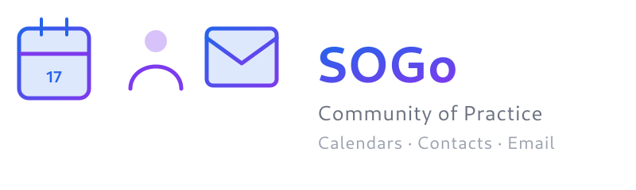

<p align="center">
  <picture>
    <source media="(prefers-color-scheme: dark)" srcset="resources/logo.png">
    
  </picture>
</p>

<p align="center">
  <a href="https://sogo.nu"><strong>sogo.nu</strong></a> ·
  <strong>Open-source groupware</strong> — calendars, contacts, and email
</p>

---

SOGo is an open-source groupware server that provides CalDAV, CardDAV, and ActiveSync-compatible access to calendars, address books, and email. It integrates natively with Thunderbird (via the SOGo Connector plugin) and Microsoft Outlook, making it a practical choice for academic institutions and non-profits that need shared calendars and email without proprietary lock-in.

The **SOGo Community of Practice** covers deployment patterns, customization options, and the roadmap ahead — whether you are evaluating SOGo for your institution or already running it in production.

## About This Repository

This repository is the home of the SOGo Community of Practice. It contains meeting notes, deployment guides, configuration recipes, and shared knowledge from practitioners running SOGo in production environments.

## Repository Structure

```
sogo-cop/
├── docs/
│   ├── meetings/       # Quarterly CoP session notes
│   ├── deployment/     # Deployment patterns and infrastructure guides
│   ├── customization/  # Theming, branding, and plugin guides
│   └── evaluation/     # Evaluation criteria and migration guides
├── resources/          # Links, references, tooling
└── CONTRIBUTING.md     # How to contribute
```

## Next Session

- **Date:** Fri, June 26, 2026 — 14:00 CEST
- **Format:** Online via BigBlueButton
- **Schedule:** Quarterly

## License

This project is licensed under the [MIT License](LICENSE) — unless otherwise noted in individual documents.
